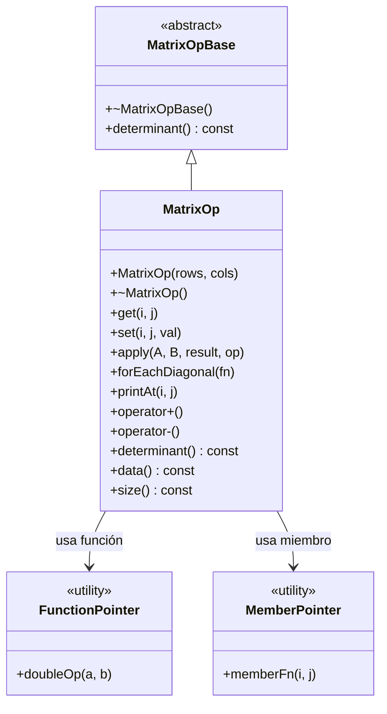

# Polimorfismo

```mermaid
classDiagram
    class MatrixOpBase {
        <<abstract>>
        +~MatrixOpBase()
        +determinant() const
    }

    class MatrixOp {
        +MatrixOp(rows, cols)
        +~MatrixOp()
        +get(i, j)
        +set(i, j, val)
        +apply(A, B, result, op)
        +forEachDiagonal(fn)
        +printAt(i, j)
        +operator+()
        +operator-()
        +determinant() const
        +data() const
        +size() const
    }

    MatrixOpBase <|-- MatrixOp

    %% Relaciones de uso representadas como clases auxiliares
    class FunctionPointer {
        <<utility>>
        +doubleOp(a, b)
    }

    class MemberPointer {
        <<utility>>
        +memberFn(i, j)
    }

    MatrixOp --> FunctionPointer : usa función
    MatrixOp --> MemberPointer : usa miembro


```
