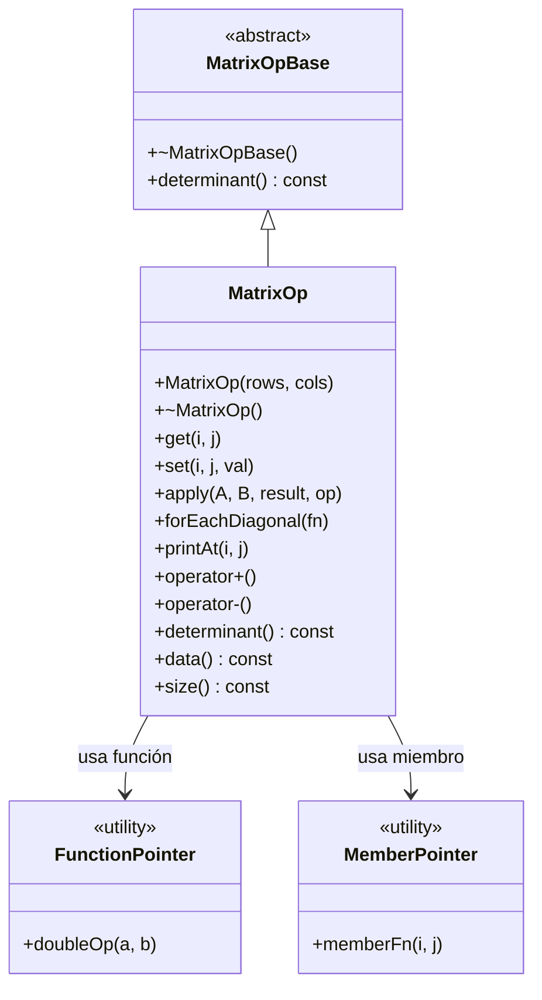
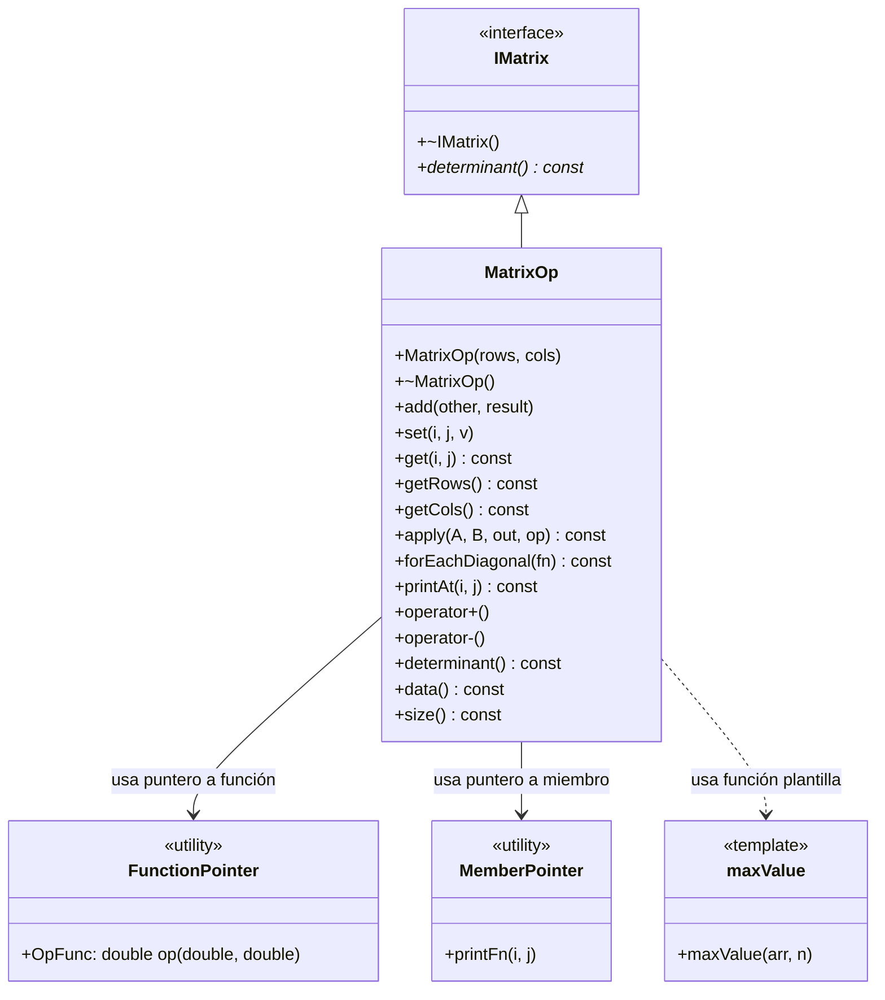

# Polimorfismo

```mermaid
classDiagram
    class MatrixOpBase {
        <<abstract>>
        +~MatrixOpBase()
        +determinant() const
    }

    class MatrixOp {
        +MatrixOp(rows, cols)
        +~MatrixOp()
        +get(i, j)
        +set(i, j, val)
        +apply(A, B, result, op)
        +forEachDiagonal(fn)
        +printAt(i, j)
        +operator+()
        +operator-()
        +determinant() const
        +data() const
        +size() const
    }

    MatrixOpBase <|-- MatrixOp

    %% Relaciones de uso representadas como clases auxiliares
    class FunctionPointer {
        <<utility>>
        +doubleOp(a, b)
    }

    class MemberPointer {
        <<utility>>
        +memberFn(i, j)
    }

    MatrixOp --> FunctionPointer : usa función
    MatrixOp --> MemberPointer : usa miembro


```

```mermaid
classDiagram
    class IMatrix {
        <<interface>>
        +~IMatrix()
        +determinant() const*
    }

    class MatrixOp {
        +MatrixOp(rows, cols)
        +~MatrixOp()
        +add(other, result)
        +set(i, j, v)
        +get(i, j) const
        +getRows() const
        +getCols() const
        +apply(A, B, out, op) const
        +forEachDiagonal(fn) const
        +printAt(i, j) const
        +operator+()
        +operator-()
        +determinant() const
        +data() const
        +size() const
    }

    IMatrix <|-- MatrixOp

    %% Relaciones de uso por punteros
    class FunctionPointer {
        <<utility>>
        +OpFunc: double op(double, double)
    }

    class MemberPointer {
        <<utility>>
        +printFn(i, j)
    }

    MatrixOp --> FunctionPointer : usa puntero a función
    MatrixOp --> MemberPointer : usa puntero a miembro

    %% Función plantilla fuera de clase
    class maxValue {
        <<template>>
        +maxValue<T>(arr, n)
    }

    MatrixOp ..> maxValue : usa función plantilla
```
