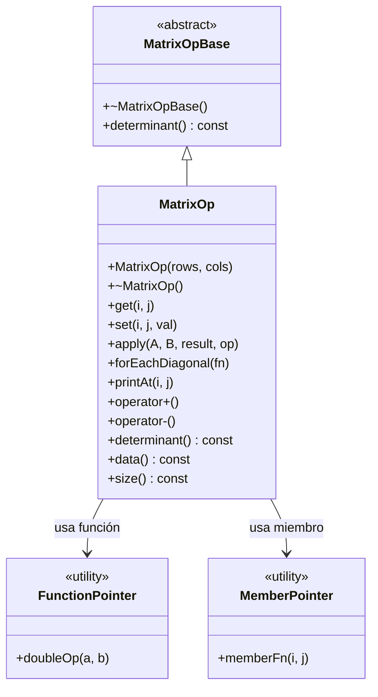
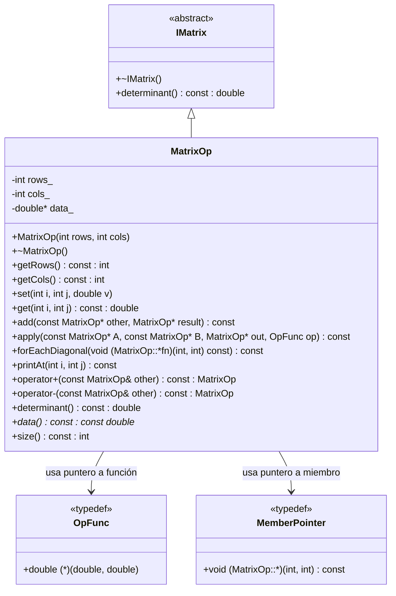

# Polimorfismo

```mermaid
classDiagram
    class MatrixOpBase {
        <<abstract>>
        +~MatrixOpBase()
        +determinant() const
    }

    class MatrixOp {
        +MatrixOp(rows, cols)
        +~MatrixOp()
        +get(i, j)
        +set(i, j, val)
        +apply(A, B, result, op)
        +forEachDiagonal(fn)
        +printAt(i, j)
        +operator+()
        +operator-()
        +determinant() const
        +data() const
        +size() const
    }

    MatrixOpBase <|-- MatrixOp

    %% Relaciones de uso representadas como clases auxiliares
    class FunctionPointer {
        <<utility>>
        +doubleOp(a, b)
    }

    class MemberPointer {
        <<utility>>
        +memberFn(i, j)
    }

    MatrixOp --> FunctionPointer : usa función
    MatrixOp --> MemberPointer : usa miembro


```

```mermaid
classDiagram
    %% INTERFAZ
    class IMatrix {
        <<abstract>>
        +~IMatrix()
        +determinant() const : double
    }

    %% CLASE PRINCIPAL
    class MatrixOp {
        -int rows_
        -int cols_
        -double* data_

        +MatrixOp(int rows, int cols)
        +~MatrixOp()

        +getRows() const : int
        +getCols() const : int
        +set(int i, int j, double v)
        +get(int i, int j) const : double

        +add(const MatrixOp* other, MatrixOp* result) const
        +apply(const MatrixOp* A, const MatrixOp* B, MatrixOp* out, OpFunc op) const
        +forEachDiagonal(void (MatrixOp::*fn)(int, int) const) const
        +printAt(int i, int j) const

        +operator+(const MatrixOp& other) const : MatrixOp
        +operator-(const MatrixOp& other) const : MatrixOp

        +determinant() const : double

        +data() const : const double*
        +size() const : int
    }

    %% HERENCIA
    IMatrix <|-- MatrixOp

    %% TIPOS DE PUNTEROS
    class OpFunc {
        <<typedef>>
        +double (*)(double, double)
    }

    class MemberPointer {
        <<typedef>>
        +void (MatrixOp::*)(int, int) const
    }

    MatrixOp --> OpFunc : usa puntero a función
    MatrixOp --> MemberPointer : usa puntero a miembro

```
